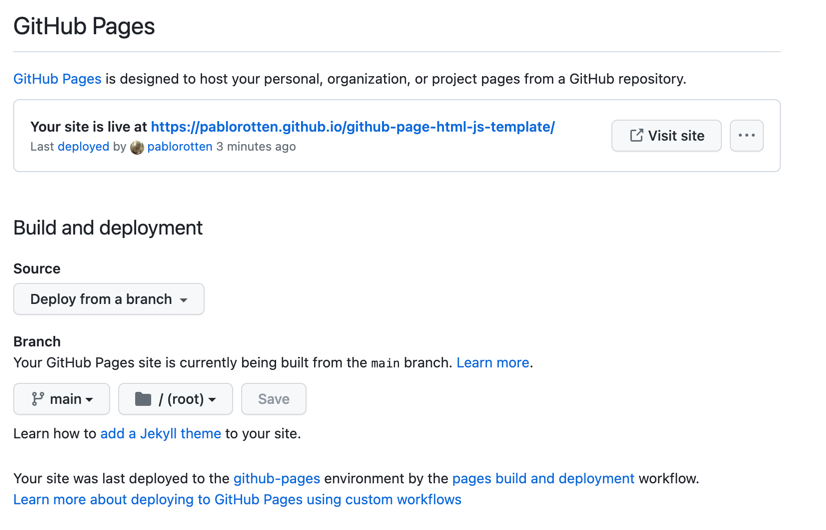

# GitHub HTML+JS page template

1. Fork this project
2. Go to `https://github.com/<username>/<project>/settings/pages`
   * Enable from a branch
   * Branch > main

   
3. Visit your page: `https://<username>.github.io/<project>/`